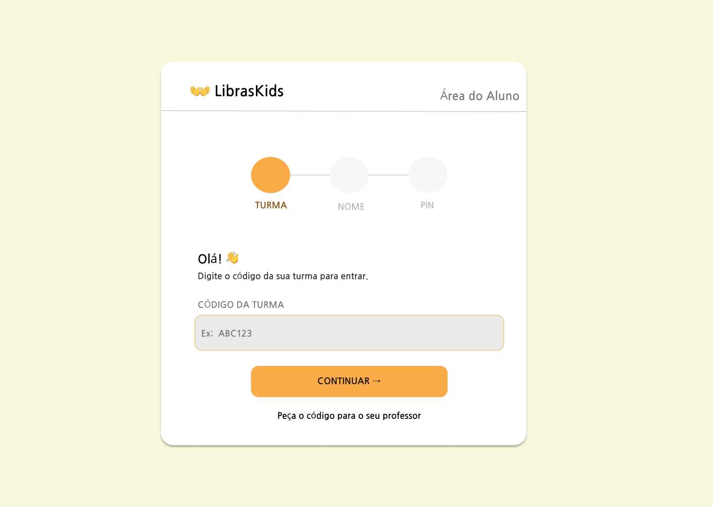
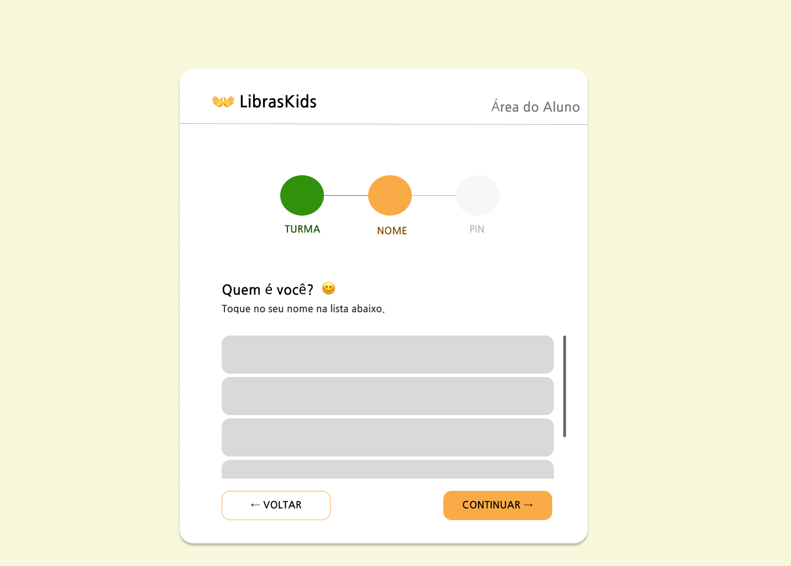
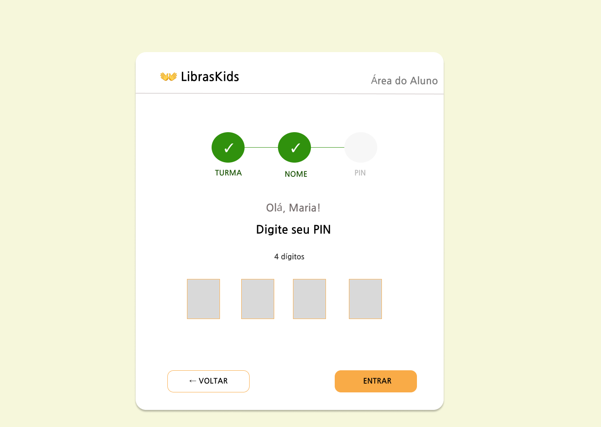
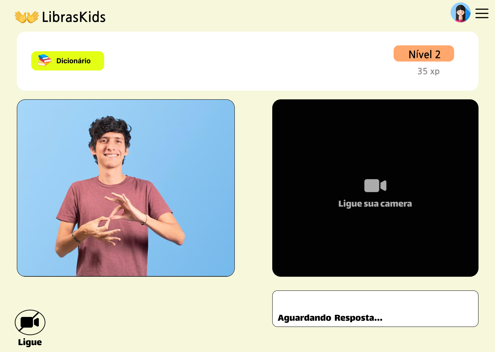
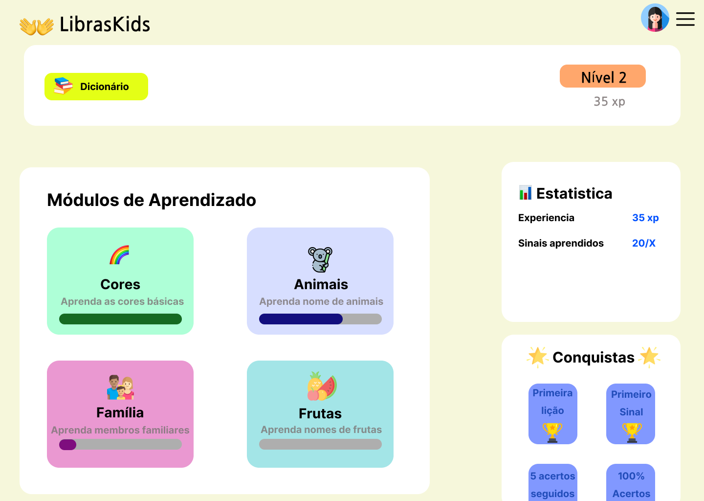

# 🤟 LibrasKids - Software Educacional com Inteligência Artificial para Ensino de Libras

<p align="center">
  <a href="https://www.linkedin.com/posts/elisandra-carol-da-silva-02424922b_libraskids-inteligenciaartificial-machinelearning-ugcPost-7473782059153670144-f8TH/?utm_source=share&utm_medium=member_desktop&rcm=ACoAADmFyNwBqC0Juse2lpfrFXJL4BSOpYksPzE" target="_blank">
    
  </a>
</p>

## 📺 Vídeo de Apresentação e Demonstração

O funcionamento da aplicação em tempo real, os testes de interface e a dinâmica de reconhecimento de sinais podem ser assistidos diretamente na publicação oficial do projeto:
👉 [Assista à demonstração completa no LinkedIn](https://www.linkedin.com/posts/elisandra-carol-da-silva-02424922b_libraskids-inteligenciaartificial-machinelearning-ugcPost-7473782059153670144-f8TH/)

---

## 📌 Sobre o Projeto

O **LibrasKids** é um software educacional interativo desenvolvido para apoiar o ensino da **Língua Brasileira de Sinais (Libras)** a crianças ouvintes por meio de uma abordagem lúdica, visual e interativa. O sistema integra uma interface web desenvolvida em **React** com um ecossistema de **Inteligência Artificial** no back-end, responsável pela coleta, organização, treinamento e validação de modelos de reconhecimento de sinais.

Como diferencial, o projeto foi estruturado para reconhecer **tanto sinais estáticos quanto sinais dinâmicos**, abrangendo não apenas letras do alfabeto manual em posições fixas, mas também **letras com movimento** e **palavras completas em Libras**, ampliando as possibilidades de interação e aprendizagem dentro da aplicação.

O desenvolvimento do LibrasKids contemplou diferentes etapas da engenharia de software, desde a prototipação da interface no **Figma**, passando pela coleta de dados com **MediaPipe** e **OpenCV**, até o treinamento dos modelos e sua posterior exportação para execução em tempo real na web por meio do **TensorFlow.js**.

---

## 👥 Equipe Desenvolvedora

Este projeto foi desenvolvido em colaboração por:

* **Elisandra Carol da Silva** — Desenvolvedora Full-Stack
* **Maria Clara Soares Bertolo** — Desenvolvedora Full-Stack

---

## 🖼️ Interface do Usuário (Protótipos do Sistema)

### 🔑 Fluxo de Autenticação Lúdica do Aluno

O processo de login foi projetado em etapas simplificadas (*steppers*) para garantir acessibilidade e usabilidade por crianças pequenas, evitando a necessidade de digitação complexa de e-mails.

|                           Passo 1: Seleção da Turma                          |                           Passo 2: Seleção do Nome                          |                   Passo 3: Entrada com PIN de 4 dígitos                  |
| :--------------------------------------------------------------------------: | :-------------------------------------------------------------------------: | :----------------------------------------------------------------------: |
|  |  |  |

### 🎓 Módulos Gamificados e Reconhecimento em Tempo Real

A área de aprendizado possui módulos temáticos organizados por conquistas e níveis de experiência, além de um espaço dedicado à captura e ao processamento da câmera local.

|                     Painel Principal (Trilhas de Aprendizado)                     |                            Interface de Captura da Câmera e IA                            |
| :-------------------------------------------------------------------------------: | :---------------------------------------------------------------------------------------: |
|  |  |

---

## 💡 Diferencial do Projeto e Arquitetura de IA

O principal diferencial do **LibrasKids** está na capacidade de reconhecer **não apenas sinais estáticos**, como letras representadas por posições fixas das mãos, mas também **sinais dinâmicos**, incluindo **letras com movimento** e **palavras completas em Libras**, como saudações e expressões.

Essa proposta amplia o escopo do software em relação a soluções que se limitam apenas ao reconhecimento do alfabeto manual estático, tornando a experiência de aprendizagem mais próxima do uso real da língua de sinais.

Para atender a essa necessidade, a arquitetura de Inteligência Artificial do projeto foi organizada em duas frentes principais:

### 🔹 Reconhecimento de sinais estáticos

Nos sinais estáticos, o sistema utiliza os pontos de referência das mãos capturados com **MediaPipe**, analisando a configuração espacial dos gestos em um único instante. Essa abordagem é aplicada ao reconhecimento de letras e sinais sem deslocamento, em que a posição da mão é suficiente para a classificação.

### 🔹 Reconhecimento de sinais dinâmicos

Nos sinais dinâmicos, o sistema precisa considerar a **sequência temporal dos movimentos**, já que a interpretação não depende apenas de uma pose isolada, mas da trajetória executada ao longo de vários quadros.

Para essa etapa, foi utilizado o algoritmo **KNN (K-Nearest Neighbors)**, aplicado especificamente na **classificação dos sinais dinâmicos**. A partir dos pontos rastreados pelo MediaPipe em múltiplos frames, o sistema compara padrões de movimento e calcula a proximidade entre a execução do usuário e os exemplos previamente mapeados na base de treinamento.

Com isso, o **KNN foi empregado como parte da estratégia de reconhecimento de letras com movimento e palavras em Libras**, permitindo ao LibrasKids lidar com gestos dinâmicos de forma mais adequada ao contexto educacional proposto pelo projeto.

---

## ⏱️ Contexto Acadêmico

* **Instituição:** FATEC Ourinhos
* **Curso:** Análise e Desenvolvimento de Sistemas (ADS)
* **Natureza:** Trabalho de Conclusão de Curso / Projeto Acadêmico

---

## 🔒 Proteção de Dados e Propriedade Intelectual

Por questões de **segurança, direitos autorais, conformidade com a LGPD (Lei Geral de Proteção de Dados)** e prevenção a plágio, determinados arquivos do ecossistema original foram intencionalmente omitidos deste repositório público por meio do arquivo `.gitignore`.

Os componentes isolados incluem:

1. **Banco de Dados Local (`backend/instance/professores.db`)**
   Ocultado para proteger informações confidenciais de cadastro.

2. **Datasets de Imagens e Amostras (`dataset/` e `Dados_Libras/`)**
   Bases brutas de mapeamento de sinais estáticos e dinâmicos, incluindo letras, saudações e emoções. A omissão desses arquivos visa preservar a base de dados produzida durante o desenvolvimento acadêmico.

3. **Assets Originais de Vídeo e Mídias (`.zip` e pastas de vídeos em `frontend/src/assets/`)**
   Arquivos utilizados no treinamento e validação do sistema, removidos da versão pública para resguardar direitos de imagem e evitar o armazenamento de arquivos binários pesados no histórico do Git.

> **Nota:** embora os dados brutos de treinamento não estejam disponíveis publicamente, os arquivos de inferência e os pesos convertidos para a web permanecem disponíveis em `frontend/public/tfjs_model/`, permitindo a execução da lógica de IA no front-end.

---

## 🛠️ Tecnologias Utilizadas

### Front-End

* React.js
* Vite
* Context API
* TensorFlow.js
* HTML5
* CSS3
* JavaScript

### Back-End

* Python
* Flask
* SQLite
* SQLAlchemy

### Inteligência Artificial e Visão Computacional

* MediaPipe
* OpenCV
* TensorFlow / Keras
* KNN (K-Nearest Neighbors)
* Modelos em `.h5`, `.keras`, `.joblib` e TensorFlow.js

### Prototipação e Organização

* Figma
* Git
* GitHub

---

## 🧠 Estrutura de IA e Processamento

A camada de Inteligência Artificial do projeto foi estruturada para contemplar diferentes etapas do reconhecimento de sinais:

* **Coleta de dados com visão computacional:** captura de landmarks das mãos utilizando **MediaPipe** e **OpenCV**.
* **Tratamento e organização dos dados:** scripts para coleta, unificação e preparação das amostras de treino.
* **Reconhecimento de sinais estáticos:** análise da posição espacial das mãos em sinais sem movimento.
* **Reconhecimento de sinais dinâmicos:** classificação de **letras com movimento** e **palavras em Libras** com apoio do **KNN**, considerando a sequência temporal dos frames.
* **Treinamento e validação de modelos:** uso de scripts em Python para gerar, testar e validar os modelos de reconhecimento.
* **Exportação para a web:** conversão dos modelos treinados para execução no navegador com **TensorFlow.js**.

---

## 📁 Estrutura de Pastas Principais

```text
meu-projeto-libras/
├── backend/
│   ├── scripts/                # Scripts de coleta, tratamento e treinamento dos modelos
│   ├── instance/
│   │   └── professores.db      # Banco de dados local (não versionado)
│   ├── app.py                  # Inicialização da aplicação Flask
│   └── models.py               # Modelagem de dados e estruturas do sistema
│
├── docs/                       # Capturas de tela e mockups da interface do sistema
│   ├── login-step-turma.png
│   ├── login-step-nome.png
│   ├── login-step-pin.png
│   ├── dashboard-aluno.png
│   └── camera-recognition.png
│
├── frontend/
│   ├── public/
│   │   └── tfjs_model/         # Modelos e pesos convertidos para TensorFlow.js
│   └── src/
│       ├── assets/             # Recursos estáticos da interface
│       ├── context/            # Contextos globais da aplicação
│       ├── pages/              # Telas do sistema
│       └── components/         # Componentes reutilizáveis
│
├── dataset/                    # Base de dados de sinais (não versionada)
├── Dados_Libras/               # Arquivos auxiliares de treino (não versionados)
└── .gitignore                  # Regras de exclusão de arquivos sensíveis
```
